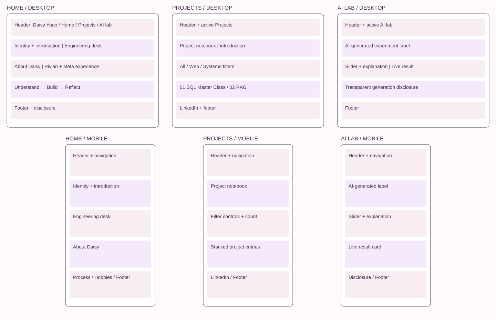

# Design Document — Daisy Yuan

## 1. Project description

A three-page personal engineering notebook introducing Daisy Yuan's CS/SWE interests and demonstrating a small, complete vanilla web project. The two portfolio entries summarize SQL Master Class and Support-Ticket RAG Assistant from Daisy’s supplied résumé. The purpose is to help a visitor understand Daisy's interests and approach in under two minutes.

Scope: static, front-end-only HTML5/CSS3/ES6+; no framework, component library, account, server, database, analytics, or private contact information. The AI lab is the designated third AI-generated page; AI assistance on the other pages is also disclosed.

## 2. User personas

These personas are hypothetical design tools, not actual research participants.

| Persona             | Context and goal                                                                        | Frustration                                                  | Design response                                                                                         |
| ------------------- | --------------------------------------------------------------------------------------- | ------------------------------------------------------------ | ------------------------------------------------------------------------------------------------------- |
| Morgan, a recruiter | Scans a portfolio on a laptop between meetings; wants clear interests and credible work | Inflated claims and unclear project status                   | Short introduction; specific roles, contributions, and project outcomes; project challenge and approach |
| Alex, a classmate   | Visits from a phone and wants to understand how the project works                       | Dense prose and interactions that only work with a mouse     | Three clear navigation links, readable responsive layout, touch-sized controls                          |
| Sam, an instructor  | Reviews source and rubric coverage; needs documentation and clear AI provenance         | Missing setup steps, hidden dependencies, or vague AI claims | README, source folders, design document, labeled AI page, prompts, and validation record                |

## 3. User stories and acceptance criteria

1. As Morgan, I want to understand Daisy's focus quickly so I can decide whether to explore further. **Acceptance:** the first viewport names Daisy and CS/SWE; a visible link leads to projects.
2. As Morgan, I want to understand each project’s contributions so I can evaluate claims fairly. **Acceptance:** project descriptions match the supplied résumé, and no unavailable demo or repository links are invented.
3. As Alex, I want to explore engineering priorities so I can see the reasoning behind the interface. **Acceptance:** each of three native buttons updates an explanation and a tradeoff; the selected state is exposed with `aria-pressed`.
4. As Alex, I want to filter project topics so I can find relevant work. **Acceptance:** All shows two, Web shows one, Systems shows one; a live result count updates with each action.
5. As a keyboard user, I want every action to be reachable and understandable. **Acceptance:** skip link, visible focus, native buttons, labeled range input, no keyboard trap.
6. As Sam, I want to inspect a clearly disclosed AI experiment so I can evaluate the assignment's third page. **Acceptance:** the AI label is visible, slider output changes across three ranges, and the disclosure identifies scope and version uncertainty.
7. As a visitor with JavaScript disabled, I want to read the introduction and work. **Acceptance:** navigation, both project entries, and default interaction explanations remain in HTML.

## 4. Information architecture

- Home (`index.html`): identity → engineering desk → about → work experience → process → hobbies.
- Projects (`projects.html`): introduction → filters → two project entries → LinkedIn link.
- AI lab (`ai-lab.html`): AI label → tradeoff mixer → generation disclosure.
- Shared: navigation, author/description/icon metadata, footer, skip link.

## 5. Design mockups

The wireframes show hierarchy and flow; screenshots show the implemented visual design. Desktop uses split columns, mobile stacks those columns. The navigation remains visible at both sizes. The project rows become vertical cards on narrow screens.

## 6. Visual design

- Plum `#45334f` for text; berry pink `#a0316b` for emphasis; light paper `#fff9fc` for background.
- System sans-serif text, Georgia italic headline accents, monospace section labels. No font download.
- 1,200px maximum content width, generous section spacing, fine dividing lines.
- CSS Grid for major page layouts; Flexbox for controls and navigation. Breakpoints at 1,000px and 720px.
- Engineering desk is the signature component: a subtly rotated desktop note card with priorities and explicit tradeoffs. Mobile removes the rotation.
- Local SVG process diagram communicates “Understand → Build → Reflect”; descriptive alt text conveys the same information.

## 7. Interaction and state design

### Engineering desk

Default: Clarity. Choosing Speed or Resilience updates four text fields and button pressed states. Data lives in `js/data.js`, behavior in `js/main.js`. Only one priority is active. No user information is stored or transmitted.

### Project filtering

Default: both projects visible. Selecting a category toggles HTML `hidden` on mismatched articles and announces the count. Static project content is not generated by JavaScript, preserving access without scripting.

### AI mixer

A native 0–100 range input selects three qualitative approaches: 0–33 lean, 34–66 balanced, 67–100 expressive. Arrow keys work through browser-native semantics. The values are design emphasis, not invented benchmark scores.

## 8. Accessibility, privacy, and resilience

HTML landmarks, one h1 per page, ordered headings, labeled native controls, current-page navigation, alt text, live updates, and keyboard focus indicators. Main text is at least 16px. Motion is limited and smooth scrolling is disabled when reduced motion is requested. No sensitive contact information, external tracking, or invented biographical details. Pages remain readable without JavaScript.

## 9. Validation plan and limits

Check three routes, navigation, asset loading, desk choices, filter counts, mixer boundaries, mobile overflow, keyboard use, no-JavaScript content, formatter, course ESLint configuration, and build. Validate each HTML page with the official W3C service, and retain the supplied course ESLint configuration when editing. See `qa-report.md` for actual completed checks; planned checks are not evidence of completion.

## 10. Authorship and review

AI generated the implementation and this design document from the supplied requirements. Daisy must verify the content and explain the code, and should confirm the instructor's policy for AI assistance on the first two pages. The exact model snapshot is unknown and is not fabricated.
